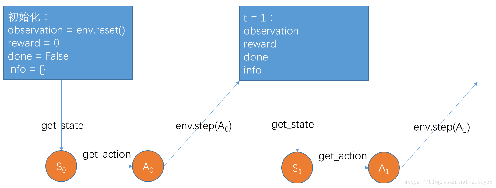

# 实践用平台
## 1. docker / anaconda /colab 
## 2. gym[ansium]库和常见的扩展
## 3. 强化学习平台 (讨论)
## 4. 多智能体强化学习平台 (讨论)
----
## 1. docker / anaconda / colab
主要目标：避免重复的环境配置
程序：.ipython, .py  
- colab的使用 参考李宏毅课程：Google_Colab_Tutorial_2023.ipynb
- pytorch的使用 
1. wsl上安装anaconda 
```
wget https://repo.continuum.io/archive/Anaconda3-5.2.0-Linux-x86_64.sh
bash Anaconda3-5.2.0-Linux-x86_64.sh
```
2. 创建环境
```
conda create -n DRLCourse python=3.8
source activate DRLCourse
```
----

## 2. pytorch的框架 + gym的强化学习库
### 2.1 pytorch
```
conda install pytorch==1.13.1 torchvision==0.14.1 torchaudio==0.13.1 pytorch-cuda=11.7 -c pytorch -c nvidia
```
- pytorch编写机器学习的框架


----
### 2.2 gym[ansium]
1. 环境库：
   1. 自己写：[03_maze.ipynb](./03_maze.ipynb)
   2. gym[ansium]库
      - 代码：https://github.com/Farama-Foundation/Gymnasium 
      - 文档：https://gymnasium.farama.org/
      - 使用关键代码 - 幕布笔记 + 下图
      

---

1. 算法库：
   1. 初学者-[spinning up](https://github.com/openai/spinningup) 
   文档：https://spinningup.openai.com/en/latest/ 
   2. 使用自定义选项-[stable baselines3](https://github.com/DLR-RM/stable-baselines3)
   文档：https://stable-baselines3.readthedocs.io/en/master/ 
   

